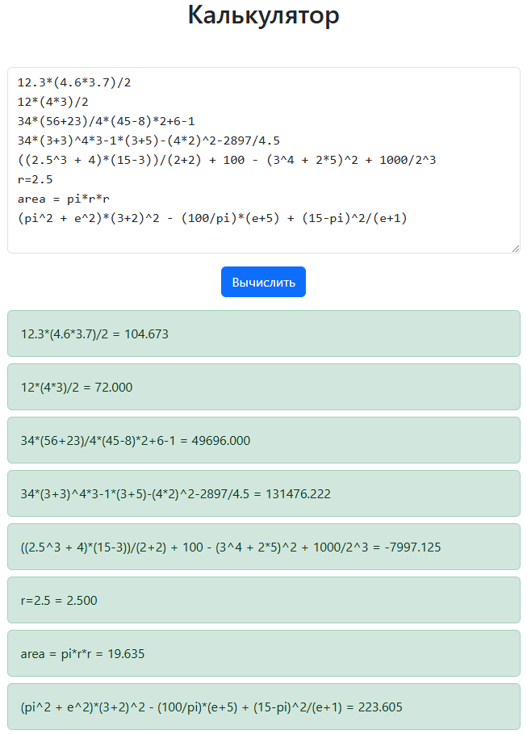

<div style="text-align: center;">
    <h1>JavaScript Calculator</h1>
</div>

<p style="text-align: center;">
    
</p>


### Описание
Данный проект представляет собой реализацию калькулятора на JavaScript, основанного на примере из книги "Язык программирования C++" (автор Бьерн Страуструп). Калькулятор поддерживает математические выражения, вычисления с переменными и основные математические операции.

### Примеры выражений

#### 1. Арифметические выражения:
```plaintext
34*(56+23)/4*(45-8)*2+6-1 = 49 696.0000
34*(3+3)^4*3-1*(3+5)-(4*2)^2-2897/4.5 = 131476.222
((2.5^3 + 4)*(15-3))/(2+2) + 100 - (3^4 + 2*5)^2 + 1000/2^3 = -7997.125
```
#### 2. Вычисления с использованием переменных
```plaintext
r = 2.5
area = pi * r * r
(pi^2 + e^2)*(3+2)^2 - (100/pi)*(e+5) + (15-pi)^2/(e+1) = 223.605
```

### Поддерживаемые операции

 - Арифметические операции: сложение (+), вычитание (-), умножение (*), деление (/)
 - Возведение в степень: оператор (^)
 - Использование скобок: для группировки операций
 - Константы: pi, e
 - Присваивание переменных: оператор (=)

### Запуск проекта

#### Вы можете запустить проект через WebStorm, либо вручную с помощью терминала:

#### 1. Перейдите в директорию проекта:

```bash
cd path/to/your/project
```

#### 2. Запустите сервер:
```bash
npx http-server .
```
#### 3. Откройте в браузере: http://localhost:8080/index.html

**Примечание: Если http-server не установлен, выполните установку:**
```bash
npm install -g http-server
```

### Требования
 - Установленный Node.js и npm